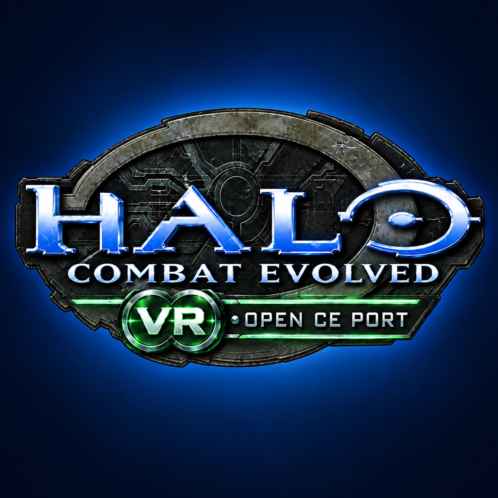

  

<h1 align="center">OpenCE-VR</h1>

<strong>Halo: Combat Evolved on standalone Meta Quest VR and Android</strong> An unofficial community port based on OpenCE.

  <a href="https://github.com/moistman42069/OpenCE-VR/releases/tag/quest-v1.0.18"><strong>Download latest release · v1.0.18</strong></a>
  &nbsp;·&nbsp;
  <a href="https://github.com/moistman42069/OpenCE-VR/pull/217">Upstream review · PR #217</a>
  &nbsp;·&nbsp;
  <a href="https://github.com/OpenCommunityEdition/OpenCE">OpenCE upstream</a>

---

## Latest release

**v1.0.18 · OpenCE Build 157 · network version 24**

| Device | Install package |
| --- | --- |
| **Meta Quest** · standalone VR | [HaloCE-Quest-1.0.18.apk](https://github.com/moistman42069/OpenCE-VR/releases/download/quest-v1.0.18/HaloCE-Quest-1.0.18.apk) |
| **Android phone or tablet** · flat play | [HaloCE-Android-1.0.18.apk](https://github.com/moistman42069/OpenCE-VR/releases/download/quest-v1.0.18/HaloCE-Android-1.0.18.apk) |

Both packages are ARM64 and require Android 9 / API 28 or newer. For Quest, enable Developer Mode and sideload the Quest package with SideQuest or ADB. Install over the existing app to preserve local data; do not uninstall or clear its data when updating. Back up important data first.

The apps do **not** include Halo game data. On first launch, import your own supported Xbox Halo CE ISO/XISO or extracted game files. See the [full v1.0.18 release notes](https://github.com/moistman42069/HaloCE-Quest-VR/blob/v1.0.18/docs/RELEASE-1.0.18.md) for setup, controls, compatibility and known issues.

## What’s included

- **Quest VR:** standalone OpenXR rendering, room-scale play, tracked body and hands, weapon-aligned aiming, comfort options and configurable VR controls.
- **Android:** touch HUD editor, multitouch, optional gyro aiming, gamepad support and controller-aware touch controls.
- **OpenCE gameplay:** native in-game multiplayer browser and campaign co-op, with network 24 hosting and selectable compatible client targets.
- **Launcher:** game-data and revision management, updates, settings, help and per-launch logs.

## Project status

This is an independent community fork of [OpenCE](https://github.com/OpenCommunityEdition/OpenCE), focused on its Quest VR and Android port. The current published app release is **v1.0.18**, based on **OpenCE Build 157**. The Quest implementation has been submitted for upstream review in [PR #217](https://github.com/OpenCommunityEdition/OpenCE/pull/217); it has not been merged into OpenCE.

The [`quest-vr-maintenance`](https://github.com/moistman42069/OpenCE-VR/tree/quest-vr-maintenance) branch is the dedicated development branch. The default `main` branch retains OpenCE’s upstream baseline.

## Credits and support

OpenCE’s decompilation and platform port are maintained by the [OpenCE contributors](https://github.com/OpenCommunityEdition/OpenCE/graphs/contributors). This project also includes the glasses-FOV and resolution contribution by [Willem Horak](https://github.com/moistman42069/HaloCE-Quest-VR/pull/1). See the [full credits](https://github.com/moistman42069/HaloCE-Quest-VR/blob/main/CREDITS.md) and [third-party notices](https://github.com/moistman42069/HaloCE-Quest-VR/blob/main/THIRD-PARTY-NOTICES.txt).

For help, DM **@MeWhenINameMyself** or visit the [Halo CE Decomp Discord](https://discord.gg/S9uSCKxKx). Include your device/OS, app version, game-data set, map or mission, connection details and relevant logs. Remove private invite or device details before posting publicly.

This unofficial project is not affiliated with or endorsed by Microsoft or 343 Industries. It contains no Halo game data or other Halo game assets.
